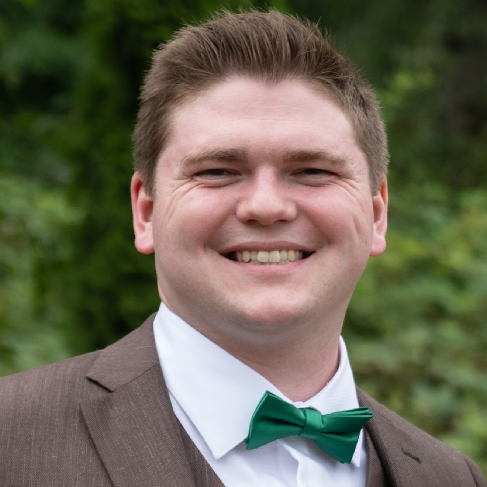

# More About Me

 

### Education

I am currently at the end of my Ph.D. program at the University of Oregon and am looking to start my career in economics, data science, or tech.

While in high school, I participated in the [Running Start](https://en.wikipedia.org/wiki/Running_Start) program, which allowed me to get my A.A. degree at the same time while I was in high school. I would highly recommend the Running Start program if it’s available in your state, and would love to chat more about it if you know someone who is interested.

Getting my associates degree so early allowed me to jump right in to my undergraduate program at the University of Washington in Seattle. In just three years, I was able to earn a double major in Mathematics and Economics. While there, I took accelerated honors courses in both Real Analysis and Computer Science, attained Honor Roll[^1] across multiple terms, and took the Core Ph.D. Microeconomics sequence during my final undergraduate year.

### Places I’ve Been

I was born and raised in the Pacific Northwest (specifically: [Bellingham, WA](https://www.bellingham.org/)). In addition to regular trips up to British Columbia, I’ve traveled to some really cool places! I’ve been on both coasts of Mexico, visited Banff National Park in Alberta, and experienced some amazing culture in Europe (Spain, France, Italy) as well as the Caribbean (Jamaica, Barbados, The Bahamas, Key West).

### Free time

I’ve always enjoyed a wide assortment of games – whether they be video, board, word, etc. Today, that looks like board games such as Bananagrams and Ticket to Ride as well as digital titles like Elden Ring and Baldur’s Gate. I’m also a big fan of [Geoguessr](https://www.geoguessr.com/) and NYT’s [Connections](https://www.nytimes.com/games/connections). In the past, I’ve had some good runs playing Magic: The Gathering, Team-based and *Battle-Royale*-style FPSs, platformers from the *Mario* franchise as well as other Nintendo classics such as *Mario Kart*, and (like many) *Pokemon Go*.

Growing up in the Pacific Northwest, I value a good hike with nice views. I also enjoy simply going for walks around my neighborhood with my wife and being able to bike to work on weather-permitting days. In my younger years, I loved snowboarding at [Mt. Baker](https://en.wikipedia.org/wiki/Mount_Baker), and I would love to pick this pastime up again in the future once my educational career is finished.

This year, my wife and I began fostering [kittens](../resources/misc/index.llms.md#Cats) through an [amazing local organization](https://catrescues.org/) in Eugene. I’ve recently resumed playing guitar, an activity I started in grade school after moving on from the cello. Additionally, I am an avid coffee drinker and so-called “foodie”. Whether it be random trivia, a new programming framework, a language, or a subject I never got around to in school, I simply love to learn new things [^2].

## Footnotes

[^1]: AKA Dean’s List

[^2]: It makes sense that I married a teacher, right?
