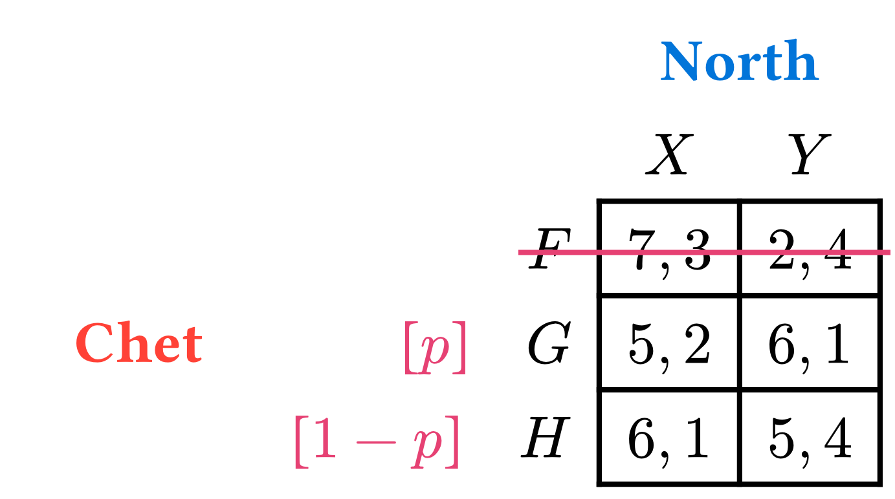
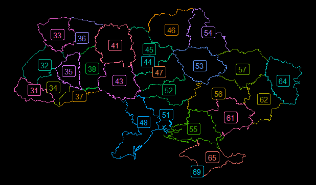
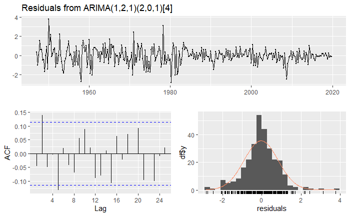

# Projects

# Fields of Interest

Within economics, my research interests include behavioral, game theory, and data science applications. Outside of economics, there isn’t a lot that *doesn’t* interest me. Linguistics, computer science, and pure mathematics are domains that I have been consistently interested in over the years.

# Academic Research

## Working Papers

#### **[Time-varying Time Preferences](../proj/research-pages/tvtp/index.llms.md)**

*With [Mike Kuhn](https://www.makuhn.net/) and [M. Steven Holloway](https://mstevenholloway.mmm.page/home)* ([Draft](research-pages/tvtp/tvtp.pdf) available)

> **TIP:**
>
> Preference reversals in intertemporal choice have long been considered hallmarks of "present-biased" discounting. While a nascent literature posits that they could instead result from time-varying discounting, the evidence comes from T = 2 longitudinal studies that cannot identify whether time-variance is noise or systematic change. We implement a longitudinal discounting study with seven elicitations over a 12-week period, and find that subjects exhibit increasing discounting over the course of the study, and that time-variance in discounting explains roughly 72% of time-inconsistent choices in our data. We introduce a new discounting model, the Nested Exponential discount function, which permits any feasible configuration of Halevy (2015)'s three properties of time preference: time-invariance, time-consistency, and stationarity. The function nests both exponential discounting and present-biased discounting within its parameter space, enabling data-driven property configurations at both the aggregate and subject levels.

#### **[AI-Assisted Communication, Trust, and Coordination in Human Partnerships: Evidence from a Trust Game Experiment](../proj/research-pages/trust/index.llms.md)**

*With [Jiabin Wu](https://sites.google.com/site/jiabinwuecon), [Ethan Holdahl](https://ethanholdahl.com/), and [Tanner Bivins](https://www.tannerbivins.com/)* ([Draft](research-pages/trust/trust-and-ai.pdf) available)

> **TIP:**
>
> We experimentally study whether AI-assisted communication facilitates trust between humans in a two-player trust game with communication before play, in which a trustor decides whether to enter a risky interaction and a trustee decides whether to reciprocate. In a 2 x 2 online experiment with 240 Prolific participants from the United States and the United Kingdom, with 30 pairs per condition, we vary whether the trustee receives GPT-3.5-turbo-0613 assistance in composing a message and whether the trustor receives AI assistance in interpreting it. We find limited evidence that AI access, whether provided to the trustor, the trustee, or both, directly changes trustors' entry decisions, trustees' reciprocation decisions, or trustors' beliefs about whether trustees will reciprocate. However, trustee AI assistance changes communication: trustees with AI access are more likely to send promises to reciprocate or requests to enter, while there is suggestive evidence that AI assisted promises are honored less often than self-authored ones. Even so, the frequency of cooperative outcomes, in which the trustor enters and the trustee reciprocates, increases directionally when trustees have access to AI. Taken together, these results point to a possible pair-level coordination effect even when average individual choices and beliefs do not shift strongly. Because the experiment uses 30 pairs per condition and one specific LLM version, the findings should be interpreted with appropriate caution.

#### **Multiple Lottery Lists**

*With [Mike Kuhn](https://www.makuhn.net/) and [M. Steven Holloway](https://mstevenholloway.mmm.page/home)*

> **TIP:**
>
> "Holloway et al. (working paper) conduct a longitudinal experiment to study agents who display time preferences matching discounting functions that are inconsistent, time-variant, and/or non-stationary. The elicitation developed for this study combines aspects of the two leading techniques for eliciting preferences across both risk and time: (double) multiple-price lists à la Andersen et al. (2008) and convex time budgets as pioneered by Andreoni and Sprenger (2012). This elicitation is a novel implementation of so-called Multiple Lottery Lists, and has numerous advantages compared to similar techniques. The elicitation and compensation mechanisms are designed to incentivize truthful reporting of one's own preferences while simultaneously keeping experiment costs low. The experiment was developed in a relatively portable manner, yet the data remain rich and well-structured. Further details of the elicitation device, including its implementation and advantages, are presented in this paper."

## Publications

#### **Market Failure**

*With [Van Kolpin](https://pages.uoregon.edu/vkolpin/Home.html)*

Forthcoming in *The Elgar Encyclopedia on the Economics of Competition, Regulation, and Antitrust* ([November 2024](#ref-KolpinWiegandforthcoming))

# Other Projects

#### [Prettier Game Theory](https://github.com/connortwiegand/typesetting-games)

Read more

As someone who has served on multiple occasions as the primary instrctor for university-level courses in game theory, there is a disappointing lack of resources available to format (typeset) ones own games. Two related projects help to fill this gap and improve resources for educators looking for similar materials. One is simply a hub for housing links, pointers, and information about said resources. The other is an open-source `typst` package – currently **featured** on Typst Universe – I made for typesetting normal form games. You can check out the general-information repository [on github](https://github.com/connortwiegand/typesetting-games) and the Typst package `game-theoryst` on [the official Typst Universe](https://typst.app/universe/package/game-theoryst)

#### [AreaCodeR](https://github.com/connortwiegand/AreaCoder)

Read more

`AreaCodeR` is a R-based Quarto project designed to pull phone number area codes from the internet and match them with level-1 administration data[^1] for a given country. This has produced 2 novel geospatial visualizations of area codes and there is open opportunity for future analysis.

#### [LOST Stats](https://lost-stats.github.io/)

Read more

I contributed to the [Library of Statistical Techniques (LOST)](https://lost-stats.github.io/). Specifically, I authored the original version of the page on Autoregressive Integrated Moving Average (ARIMA) models, found [here](https://lost-stats.github.io/Time_Series/ARIMA-models.html)

#### Want more?

Check out my [GitHub](https://github.com/connortwiegand)!

## References

Kolpin, Van, and Connor Thomas Wiegand. November 2024. “Market Failure.” In *The Elgar Encyclopedia on the Economics of Competition, Regulation and Antitrust*, edited by Michael D. Noel. Edward Elgar Publishing.

## Footnotes

[^1]: Top level classification of regions within a nation-state. E.g. States, Provinces Oblasts, etc.
